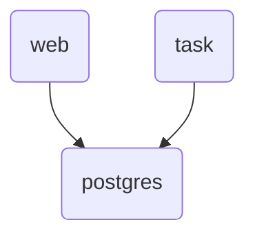

## Vision for Dispatcher

The dispatcher strives to be an extremely contained, simple library,
by assuming that your system already has a source-of-truth.

This will:
 - run python tasks

This will not:
 - provide a result backend
 - treat the queue as a source of truth

For problems that go beyond the scope of this library,
suggestions will go into a cookbook.

https://taskiq-python.github.io/guide/architecture-overview.html#context

https://python-rq.org/docs/workers/

